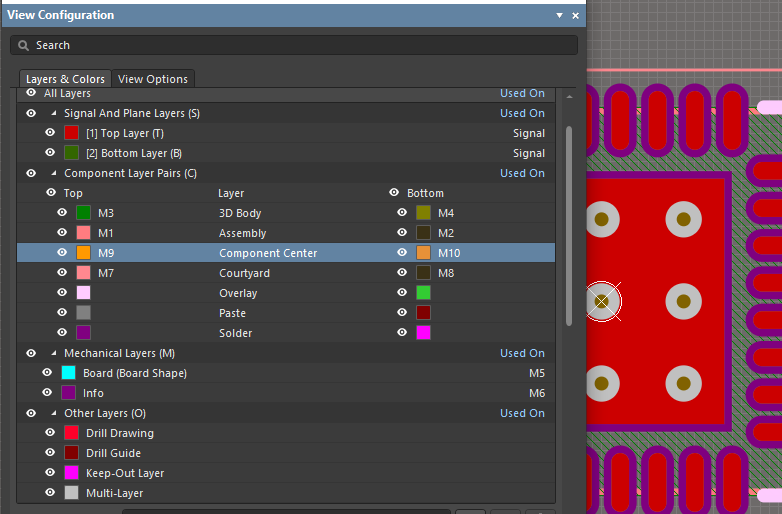
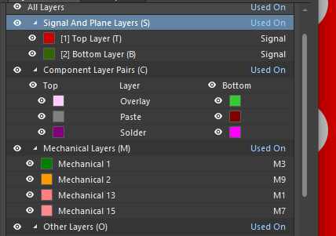

# AD Library

Библиотека компонентов для Altium Designer
## Для правильной работы базы данных
1. Установить библиотеки: pip install pandas xlsxwriter
2. Запускать csv2xlsx.py после каждого изменения csv-файлов.

## Правила оформления фунпринтов

Подробнее

1. Каждый футпринт должен иметь адекватное имя, с помощью которого моно его идентифицировать. Имя в формате IPC или согласно других общепринятых документов. Например: `LQFP32`, `SO16`, `QFN48` и др.
2. Нумерация выводов должна соотвествовать нумерации согласно datasheet на данный футпринт/компонент. Если нумерация выводов не указана явно, необходимо руководствоваться общепринятыми нормами.
   
   
3. Центр изображения футпринта __должен распологаться в координатах (0; 0)__. Это необходимо для нормального использования и получения адекватных данных для автоматического монтажа.
4. Футпринт должен иметь шелкографию, толщина линии 0,2 мм. Исключение - очень маленький компонент
5. Первый вывод компонента помечается точкой в виде текста, а не графического круга. Это позволить легко двигать точку на уже готовой плате и не мучиться с разлочиванием примитивов компонента.
   
   
6. Механические отверстия помечаются как `MH`, если не должно паяться, то не делать метализацию (снять галку PLATED!)
   
   

## Правила оформления УГО

Подробнее

Скоро будет ...

## Правила оформления слоёв для посадочных мест

Подробнее

Проблема возникает, когда разные разработчики создают элементы посадочных мест в слоях с разной нумерацией. Например, у кого-то Assy слой - это М1, а 3d_body - M3, у кого-то наоборот или совсем другие слои. При использовании таких посадочных мест вместе в одном .PcbDoc файле возникает неуправляемый "зоопарк слоёв", который не позволяет быстро настраивать видимость групп слоёв (Layer Sets), необходимую для комфортной расстановки и разработки топологии. Есть два решения.

1. Самый правильный вариант (Altium его рекомендует) - создавать слои, указывая атрибут Layer type. Тогда при переносе посадочного места в .PcbDoc AD будет знать, как изменить номера слоёв чтобы сохранилось единообразие отображнения.
   
   Пример на рисунке ниже.

   

   1.1. Чтобы создать парные Top + Bot слои (т.е. такие слои, у которых при перемещении компонента на обратную сторону печатной платы всё содержимое автоматически переместится в парный слой, например, все линии в слое Top Assy станут линиями в Bot Assy).
   
   * ПКМ по списку слоёв, затем выбрать Add Component Layer Pair
  
   
   
   * Указываем имя (любое, можно не указывать вообще, тогда туда автоматически впишется Layer Type)
   * Выбираем номера слоёв (как уже отмечалось, это не имеет значения при корректной установке Layer Type)
   * Выбираем Layer Type (см ниже)

   
  
   * В данной библиотеке используются следующие парные слои:
       * Assembly - для указания охватывающего габарита компонента, а также его позиционного обозначения, если оно не указывается в слое шелкографии. Используетсяч для формирования сборочного чертежа и ручного монтажа компонентов.
       * 3D Body - для размещения модели компонента. Используется для визуализации готовой печатной платы.
       * Courtyard - для указания зарезервированного пространства вокруг компонента, в которое не должны попадать другие компоненты при их расстановке на печатной плате.
       * Component Center - для указания центра компонента, который используется при автоматическом монтаже.
  
  1.2. Для создания непарных слоёв (т.е. таких, элдементы которых никуда не переходят при перемещении компонента на другую сторону платы).

   * ПКМ по списку слоёв, затем выбрать Add Mechanical Layer  
   * Указываем имя (любое, можно не указывать вообще, тогда туда автоматически впишется Layer Type)
   * Выбираем номер слоя (как уже отмечалось, это не имеет значения при корректной установке Layer Type)
   * Выбираем Layer Type (см ниже)

   

   * В данной библиотеке используются следующие слои:
      * Board Shape - для разъёмов и компонентов, которые необходимо установить на строго определённое расстояние от края платы
      * Dimensions - размеры и прочие заметки

2. Быстрый способ для экономии времени - перенумеровать только используемые слои в порядке, применяемом в данной библиотеке. При этом переименовывать их не обязательбно!
   
   

   На рисунке видна старая нумерацимя в названии слоя (Mechanical... слева) и новая в имени фактически используемого слоя (М... справа). Функциональное назначение слоёв см. в разделе 1.
   Порядок следующий:
   
   Парные слои:
   * Top Assy              - M1 
   * Top 3D                - M3
   * Top Courtyard         - M7
   * Top Component center  - M9

   Не парные слои:
   * Board shape           - M5 
   * Dimensions            - M6 
  
  В подавляющем большинстве случаев посадочное место разрабатывается при виде сверху, поэтому Bot слои, как правило, не используются, необходимость их переномеровывать не возникает. Ниже они приводятся справочно.
   
   * Bot Assy              - M2 
   * Bot 3D                - M4
   * Bot Courtyard         - M8
   * Bot Component center  - M10

