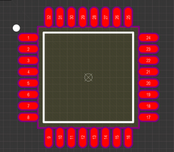
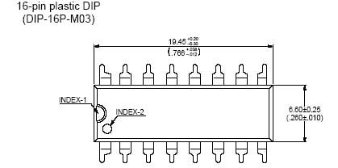
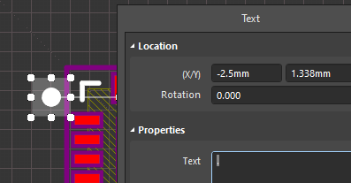
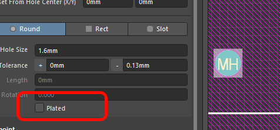

# AD Library

Библиотека компонентов для Altium Designer
## Для правильной работы базы данных
1. Установить библиотеки: pip install pandas xlsxwriter
2. Запускать csv2xlsx.py после каждого изменения csv-файлов.

## Правила оформления фунпринтов

Подробнее

1. Каждый футпринт должен иметь адекватное имя, с помощью которого моно его идентифицировать. Имя в формате IPC или согласно других общепринятых документов. Например: `LQFP32`, `SO16`, `QFN48` и др.
2. Нумерация выводов должна соотвествовать нумерации согласно datasheet на данный футпринт/компонент. Если нумерация выводов не указана явно, необходимо руководствоваться общепринятыми нормами.
   
   
3. Центр изображения футпринта __должен распологаться в координатах (0; 0)__. Это необходимо для нормального использования и получения адекватных данных для автоматического монтажа.
4. Футпринт должен иметь шелкографию, толщина линии 0,2 мм. Исключение - очень маленький компонент
5. Первый вывод компонента помечается точкой в виде текста, а не графического круга. Это позволить легко двигать точку на уже готовой плате и не мучиться с разлочиванием примитивов компонента.
   
   
6. Механические отверстия помечаются как `MH`, если не должно паяться, то не делать метализацию (снять галку PLATED!)
   
   

## Правила оформления УГО

Подробнее

Скоро будет ...

